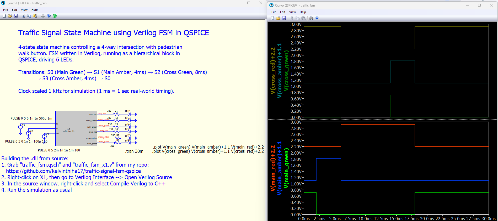

# Traffic Signal FSM in QSPICE

A 4-state finite state machine controlling a 4-way intersection with a pedestrian walk button. Written in Verilog, simulated in QSPICE, with LED output stages.

## Overview

This project implements a traffic signal controller for an intersection between a Main Road and a Cross Road. When a pedestrian presses the walk button, the FSM cycles through amber and red states for both roads on a fixed timing schedule, then returns to the default state.

Originally built as a discrete TTL circuit on a breadboard for Rutgers Digital Logic Lab (Fall 2024). Rebuilt from scratch as a Verilog module in QSPICE to clean up the design and verify the state transitions in simulation.

## States

| State | Main Road | Cross Road | Duration                       |
| ----- | --------- | ---------- | ------------------------------ |
| S0    | Green     | Red        | Default, waits for walk button |
| S1    | Amber     | Red        | 4 clock cycles                 |
| S2    | Red       | Green      | 8 clock cycles                 |
| S3    | Red       | Amber      | 4 clock cycles                 |

Cycle triggered by walk button press: S0 → S1 → S2 → S3 → S0.

## Design

- **FSM core** written in Verilog as a hierarchical block in QSPICE
- **2-bit state register** encoding the four states
- **4-bit counter** for state timing
- **Asynchronous reset** forces the FSM into S0 on power-up
- **6 LED output stages** (330Ω current-limiting resistors + LEDs) driven directly from the FSM outputs

Simulation clock is scaled to 1 kHz so 1 ms of simulation time represents 1 second of real-world timing. Makes the full cycle visible in a short simulation window.

## Files

| File                 | Description                                              |
| -------------------- | ---------------------------------------------------------- |
| `traffic_fsm.qsch`   | QSPICE schematic — lightweight, no embedded bitmap plots    |
| `traffic_fsm_x1.v`   | Verilog source for the FSM module                           |
| `traffic_fsm_x1.dll` | Compiled Verilog module (auto-generated by QSPICE)          |
| `overview.png`       | Screenshot of the schematic and live waveform output        |

## How to Run

Requires [QSPICE](https://www.qorvo.com/design-hub/design-tools/interactive/qspice) installed.

1. Clone or download the repository
2. Open `traffic_fsm.qsch` in QSPICE
3. Run the simulation (F5 or the run button) — the `.plot` directives will automatically generate the Main Road and Cross Road waveform windows

The `.tran 30m` directive is already set for a 30 ms simulation window, which covers the full walk-triggered cycle plus a return to S0.

### Building the .dll from source

Instructions for compiling the Verilog module yourself (instead of using the provided `.dll`) are included as a comment block directly in `traffic_fsm.qsch`. In short:

1. Right-click on X1, then go to **Verilog Interface** → **Open Verilog Source**
2. In the source window, right-click and select **Compile Verilog to C++**
3. Run the simulation as usual

## Author

**Kyaw (Kelvin) Ha** — Computer Engineering @ Rutgers '27
[LinkedIn](https://linkedin.com/in/kyawha) • [Portfolio](https://kelvinthiha17.github.io/portfolio)

## License

MIT
